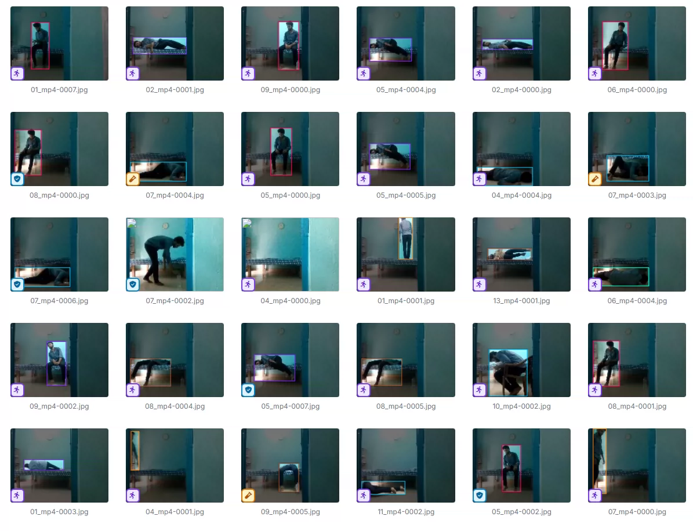
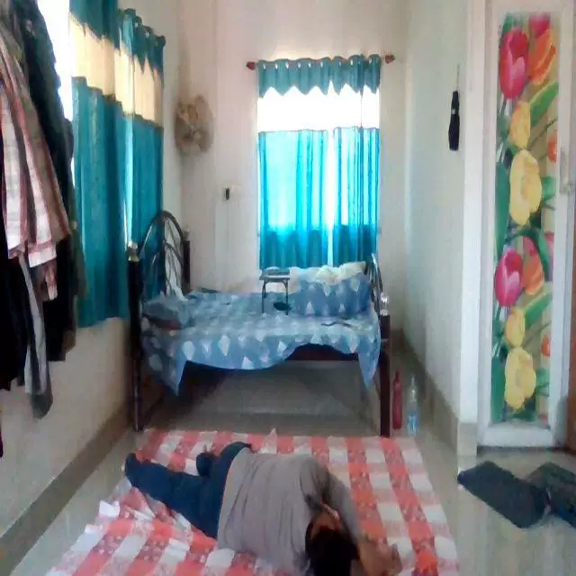
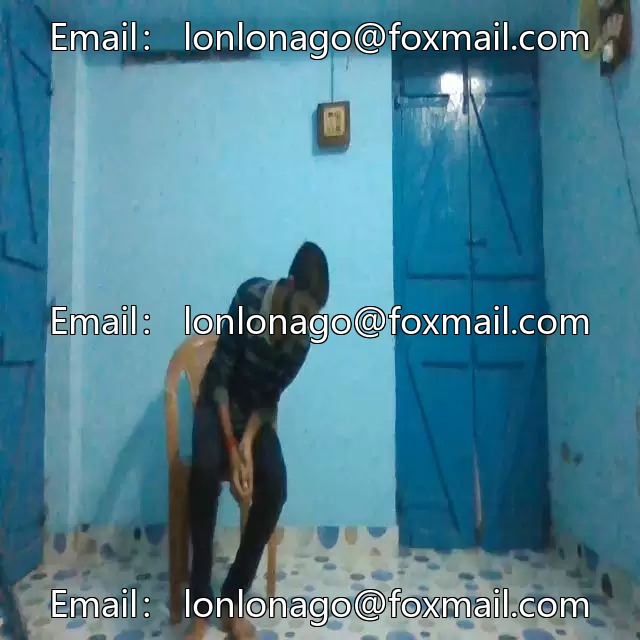

## Body

Falling posture detection, target detection in YOLO format

Totally 1k images, labeled separately. Training set, test set, validation set have been divided.

Divided into 12 categories, which are 'Fall-Backward Fall', 'Fall-Forward Fall', 'Fall-Side Fall', 'Non-Fall-Drinking', 'Non-Fall-Eating', 'Non-Fall-Exercising', 'Non-Fall-Reading', 'Non-Fall-Standing', 'Non-Fall-Walking', 'Non-Fall-Writing', 'Non-Fall-sitting', 'Non-Fall-sleeping'.

'Reverse fall', 'Forward fall', 'Side fall', 'No falling drink', 'No falling eat', 'No falling exercise', 'No falling read', 'No falling stand', 'No falling walk', 'No falling write', 'No falling sit', 'No falling sleep'.

Electronic virtual products sold without return or exchange.

## Images

Here is a pay link on Stripe ( https://buy.stripe.com/3cs8yP7sY87d0vu9AB ). Please contact me lonlonago@foxmail.com after funding $89, and I will send you a complete data files , thank you!

